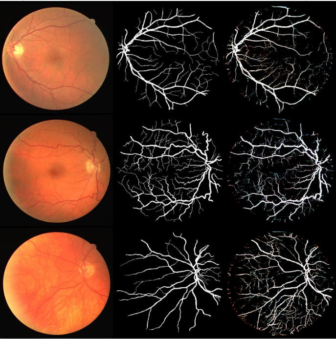

# CycleGAN

We implement a CycleGAN model to perform unpaired image to image translation from an image domain A to an image domain B. Domain A consists of images from diabetic retinopathy screening. These are digital images of the retina. Domain B consists of images of the vasculature of the retinal images. Highly trained professionals produce vasculature annotations. Our program tries to automate generating annotated images from the retinal images using CycleGAN. 

### Results:
|1st column: Retinal Images / 2nd column: Vasculature Annotation / 3rd row: Vasculature Annotation(Generated by CycleGAN)|
|:---:|
||


### Dataset
The model was trained on the Digital Retinal Images for Vessel Extraction dataset [link](https://drive.grand-challenge.org/).

### Training
To set the parameters edit the config.py file and then run the main.py file. Alternatively, a jupyter notebook implementation(main.ipynb) is also provided for training the CycleGAN model. 

### CycleGAN Paper
Unpaired Image-to-Image Translation using Cycle-Consistent Adversarial Networks by Jun-Yan Zhu, Taesung Park, Phillip Isola, Alexei A. Efros

```
@misc{zhu2020unpaired,
      title={Unpaired Image-to-Image Translation using Cycle-Consistent Adversarial Networks}, 
      author={Jun-Yan Zhu and Taesung Park and Phillip Isola and Alexei A. Efros},
      year={2020},
      eprint={1703.10593},
      archivePrefix={arXiv},
      primaryClass={cs.CV}
}
```


